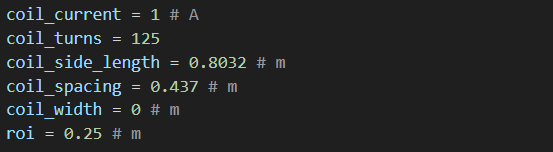
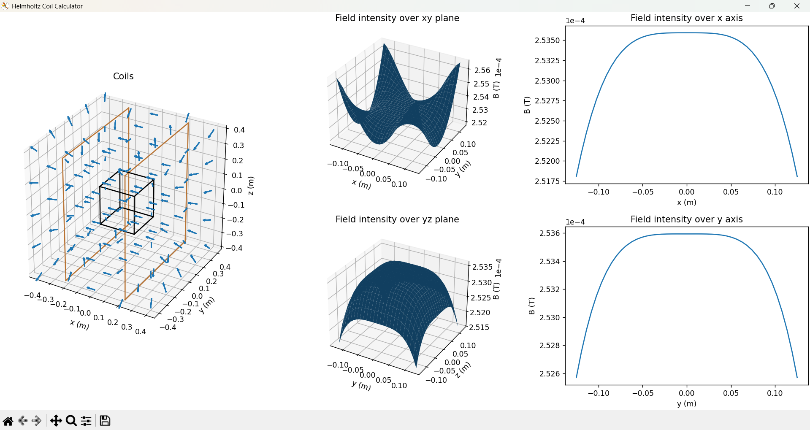
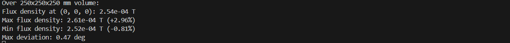

# Square Helmholtz Coil Calculator

This is a basic calculator for analysing field strength and uniformity in a square Helmholtz coil, using matplotlib.

## Usage
Clone the repo from GitHub open the folder in a terminal. Activate a virtual environment if you wish and then run:

`pip install -r requirements.txt`

Once you have installed the necessary packages you can edit the inputs in `calculate.py` and run the program.

`python src/calculate.py`

The matplotlib layout manager is not perfect so you may need increase the window size to avoid overlapping plots.
